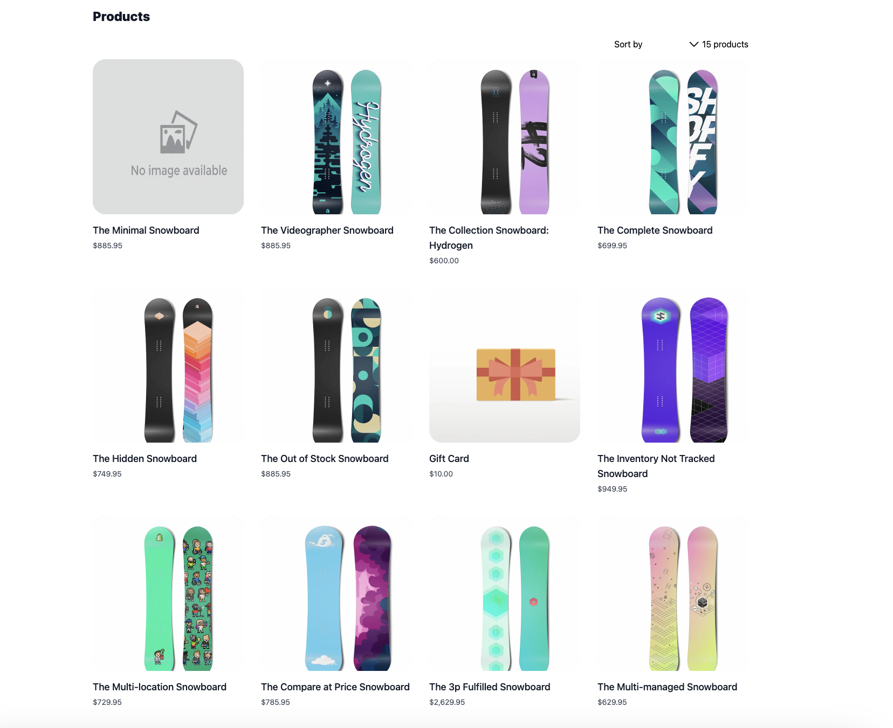

# Shopify Next JS GraphQL Typescript

🚀 A brief description of your project.

## Technologies Used

🔧 Built with Next.js, TypeScript, GraphQL, and Shopify services.

### Prerequisites

✅ Node.js and npm should be installed on your machine.


### Installation

📥 Clone the repository:

```shell
git clone  https://github.com/muzeyr/shopify-nextjs-graphql-typescript.git
```

📦 Install the dependencies:

```shell
npm install
```

Configuration
⚙️ Configure the necessary environment variables:

Create a .env file in the project root directory.
Add the required environment variables:

```shell
npm install
```
Configuration
⚙️ Configure the necessary environment variables:

Create a .env file in the project root directory.
Add the required environment variables:

```
NEXT_PUBLIC_SHOPIFY_STOREFRONT_ACCESS_TOKEN=
STORE_NAME=
API_URL=
PLACE_HOLDER_IMAGE=
```

Running the Project
🏃 Start the development server:

```shell
npm run dev
```


 Open your browser and navigate to http://localhost:3000 to see the project in action.


 
